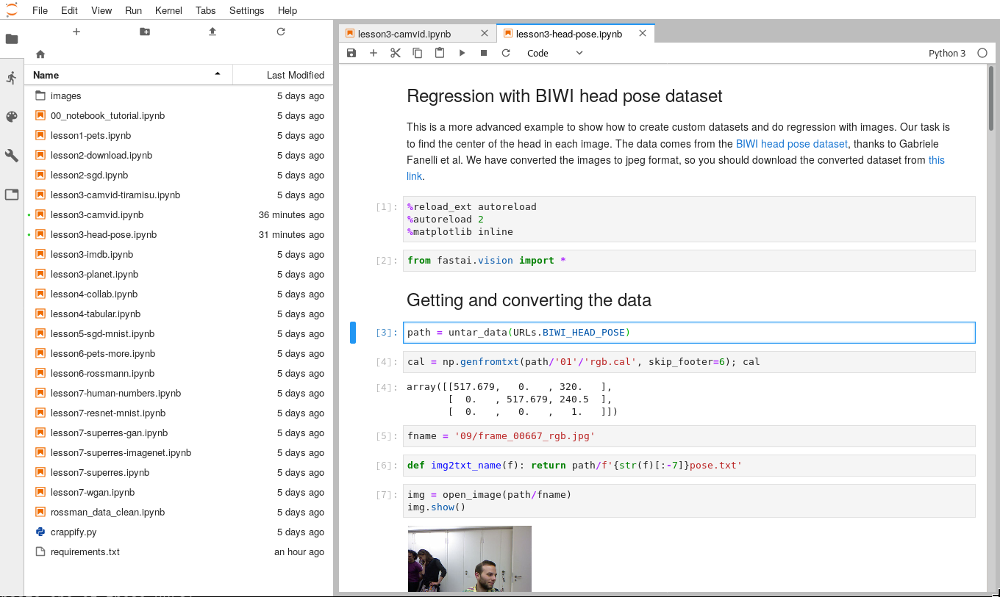

# Pytorch and Nvidia GPUs

- [Pytorch and Nvidia GPUs](#pytorch-and-nvidia-gpus)
  - [Overview](#overview)
  - [Setup](#setup)
  - [Dockerfile](#dockerfile)
  - [Running the container](#running-the-container)
  - [Check what processes are running](#check-what-processes-are-running)
  - [Commit the container](#commit-the-container)
  - [Execute a new shell inside the container](#execute-a-new-shell-inside-the-container)

## Overview

In this hands-on tutorial, the objective is to run a container for AI with pytorch. The novelty is the use of graphics card, that are _injected_ into the container (the nvidia driver is). The principal components are:

* A _JupyterLab_ server to interact with the notebooks.
* A pytorch installation with cuda.
* A set of example notebooks from the incredible _fastai_ [course](https://course.fast.ai/).

## Setup

First, download the _fastai_ course.

```
wget -O course-v3.zip https://github.com/fastai/course-v3/archive/master.zip
unzip course-v3.zip
mv course-v3-master course-v3
```

The notebooks are in the directory `course-v3/nbs/dl1`.

## Dockerfile

As before, a specification of all the files, configuration and dependencies are going to be specified with a _Dockerfile_.

```dockerfile
# pytorch provides an official image in the dockerhub
# This image has all the cuda dependencies, such as cudnn
# Notice the tag of this image encodes the version of the pytorch
#  and the version of the cuda and cudnn
FROM pytorch/pytorch:1.1.0-cuda10.0-cudnn7.5-runtime

# Define the workin directory to be /workspace
WORKDIR /workspace

# The requirements.txt file has all the python dependencies required
#  for this image
# This file is first copied to the /workspace
COPY requirements.txt /workspace
# And then we pip install all the dependencies
RUN pip install -r requirements.txt

# Jupyter lab does not allow to run from the root user,
#  that is the default
# So, we need to add a new user called deep
RUN useradd --create-home deep
# And then define it as the default user
USER deep

# Copy all the course notebooks to the workspace
COPY course-v3/nbs/dl1/ /workspace

# Jupyter lab listens on port 8888, so we will define that
#  the port should be used
EXPOSE 8888

# Finally, define the default command to be run in the container
# See the jupyter lab documentation for further information
CMD ["jupyter", "lab", "--ip", "0.0.0.0"]
```

Then, build the container as before: `podman build -t fastai-course .`

## Running the container

```
podman run -p 8888:8888 fastai-course
```

Now visit the webpage [localhost:8888](http://localhost:8888) and login to the jupyter lab (use the token shown in the shell).



## Check what processes are running

```
podman top <container>
```

## Commit the container

Supose that you want to save the state of your container (after downloading the datasets, for example). Just commit the container.

```
podman commit <container> fastai-course-full
```

## Execute a new shell inside the container

```
podman exec -it <container> bash
```
